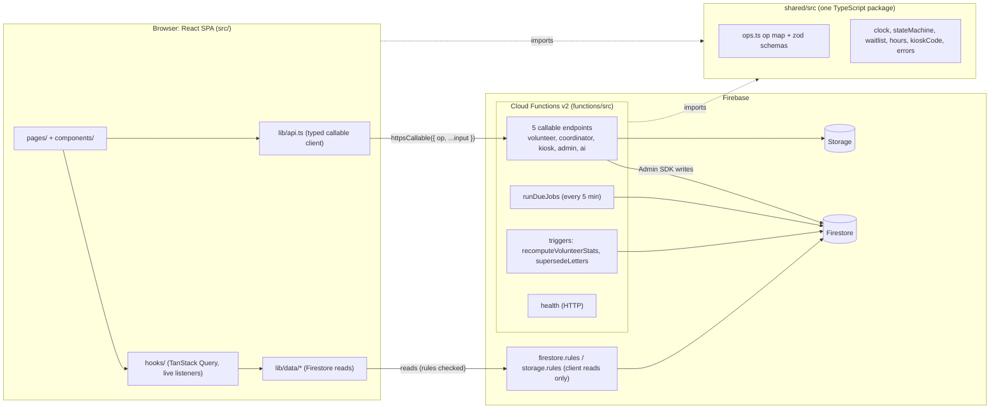

# Architecture

How Pitch In is put together, for new contributors and for explaining the code to judges. `docs/SPEC.md` is the source of truth for behavior; this file is the map. Every path below exists in the repo.

## 1. The big picture

The rule that shapes everything: **clients read, the server writes.** The browser reads Firestore directly (fast, live, and limited by the security rules), but every trusted change (sign up, check in, issue a letter) is a callable op that validates and authorizes itself on the server. The only client writes are a person's own display preferences and saved items.

## 2. Folder map

| Path | What lives there |
|---|---|
| `src/pages/` | One file per route (lazy-loaded through `src/lib/lazyWithReload.ts`); `src/router.tsx` lists them all |
| `src/layouts/` | The app shell: `AppLayout.tsx` (header, skip link, focus on navigate, footer, tab bar), `AccountControls.tsx`, `navItems.ts` |
| `src/components/` | UI by feature (`explore/`, `kiosk/`, `org/`, `help/`, `palette/`, `notifications/`, `seo/`...), shared bits in `ui/`, vendored React Bits in `bits/` |
| `src/hooks/` | Data hooks over TanStack Query; `useLiveQuery.ts` turns a Firestore listener into a shared cache entry |
| `src/lib/data/` | Repositories: one module per domain, every document parsed with the shared zod schema |
| `src/lib/` | Pure logic with tests: search engine (`search/`), Explore filters and map points (`explore/`), help library (`help/`), palette commands (`palette/`), head tags and sitemap (`seo/`) |
| `src/store/` | Zustand stores: session (`authStore.ts`) and display preferences (`preferencesStore.ts`) |
| `src/styles/tokens.css` | Every color, font, radius, spacing, shadow, and motion value (see 9) |
| `src/content/help/` | Help articles in Markdown; bundled into the app and copied next to the Functions bundle for the assistant |
| `shared/src/` | Code both sides import: op map, schemas, clock, state machine, waitlist, hours, kiosk code, error catalog, notifications copy |
| `functions/src/` | `endpoints/` (dispatch tables), `ops/` (one handler per op), `lib/` (defineCallable, auth, rate limit, env), `shifts/`, `kiosk/`, `letters/`, `reports/`, `jobs/`, `triggers/`, `seed/` |
| `tests/rules/` | Security rules tests against the emulator |
| `functions/test/` | Op, job, and trigger tests against the emulators |
| `e2e/` | Playwright specs (three-device Tier 0 loop, lane specs, smoke + axe) |
| `scripts/` | `demo.mjs`, `doctor.mjs`, `seed-demo.mjs`, `demo-reset.mjs`, `build-functions.mjs`, `check-tokens.mjs` |

## 3. Data model summary

Names come from `shared/src/collections.ts`; every document has a zod schema in `shared/src/schemas/`.

| Collection | Holds | Written by |
|---|---|---|
| `organizations/{orgId}` (+ `members/{uid}`, `letterRefs/{id}`) | Public org profile, verification flag, coarse geo; members with role | ops (`registerOrganization`, `redeemInvite`, `verifyOrganization`...) |
| `opportunities/{id}` | What the volunteering is (title, cause, location) | `upsertOpportunity` |
| `instances/{id}` | One dated shift: times, capacity, `signupCount`, ordered `waitlist`, status, `nextActionAt` | `createInstance`, `updateInstance`, signup ops, jobs |
| `instanceSecrets/{id}` | Per-shift salt for kiosk codes (never readable by clients) | `createInstance`, seed |
| `signups/{instanceId_uid}` | One person on one shift; deterministic id so double taps cannot double-book | `signup`, `cancelSignup`, `checkIn`, `checkOut`, `finalizeShift` |
| `signupContacts/{id}` | Contact snapshot for coordinators (hidden for minors at unverified orgs) | triggers, ops |
| `hoursLogs/{id}` | Credited minutes per shift or manual entry, with approval status | `checkOut`, `submitManualHours`, `approveHours`, `rejectHours` |
| `letters/{id}`, `letterVerifications/{code}` | Issued letters and their public verification record | `issueLetter`, `revokeLetter`, `supersedeLetters` |
| `users/{uid}` (+ `private/profile`, `saved/{id}`) | Public totals and badges; private profile (birth date, ZIP geohash, preferences); saved items | `completeProfile`, `updateProfile`, stats trigger; saved items by the owner |
| `notifications/{uid}/items/{id}` | In-app alerts | ops via `functions/src/notifications/notify.ts`; read flag via `markNotificationsRead` |
| `invites`, `reports`, `orgVerificationLog`, `contactRefreshJobs` | Tier 1 org administration | ops and jobs |
| `rateLimits`, `aiUsage`, `turnstileTokens`, `jobLeases`, `jobRuns`, `demoClock`, `meta` | System state | server only |

## 4. One trusted write, end to end (signup)

1. `src/components/shifts/SignupAction.tsx` calls `api.volunteer.signup({ instanceId })` from `src/lib/api.ts`.
2. The client sends `httpsCallable("volunteer")({ op: "signup", instanceId })`.
3. `functions/src/endpoints/volunteer.ts` lists the op; `createEndpointHandler` in `functions/src/lib/defineCallable.ts` looks it up and runs the pipeline: App Check, auth present, kiosk-token scoping, input schema from `shared/src/ops.ts`, profile gate, resource resolution and role check, rate limit.
4. `functions/src/ops/signup.ts` runs one Firestore transaction: reads the instance, checks the state (`shared/src/stateMachine.ts`), age and verified-org rules, seats, then writes the signup (or a waitlist entry) and bumps `signupCount`.
5. The output is checked against the op's output schema, logged as one structured line with a `requestId`, and returned as `{ ok: true, data, requestId }`.
6. The client re-validates the output, and the screen re-renders from its live Firestore listener; there is no optimistic UI.

Errors are thrown by code (`shared/src/errorCatalog.ts`) and reach the screen as a friendly `UserError` with a fix and a help link (`src/components/errors/ErrorNotice.tsx`).

## 5. Op dispatch and adding an op

`shared/src/ops.ts` is one map: endpoint, then op name, then `{ input, output }` zod schemas. The Functions dispatch tables (`functions/src/endpoints/*.ts`) and the client API (`src/lib/api.ts`) are both checked against it, so a missing handler or a stray op fails tests.

To add an op (SPEC 10.9): (1) schemas in `shared/src/schemas/ops/`; (2) entry in `shared/src/ops.ts`; (3) `functions/src/ops/<op>.ts` with `defineCallable`; (4) list it in its endpoint file; (5) call it through `src/lib/api.ts`; (6) add or update the rules row if it touches a new collection; (7) write the op test in `functions/test/`, including cross-org and kiosk-token denial; (8) add the row to SPEC's API table.

To add a screen: create `src/pages/<Name>Page.tsx` (default export, `PageHeader` for the focusable h1), add it to `src/router.tsx` under the right guard, add its title and indexing rule to `src/lib/seo/routeMeta.ts`, and, if people should find it from anywhere, a destination in `src/lib/palette/paletteCommands.ts`.

## 6. The clock

`shared/src/clock.ts` is the only source of "now" on both sides. Functions build a request clock (`functions/src/lib/requestClock.ts`) that adds the demo offset from `demoClock/global`; the browser applies the same offset through `src/hooks/useDemoClockSync.ts`, so countdowns, kiosk windows, and "check-in opens at" text agree on every device. The offset can be set only by an admin through `admin.setDemoClock`, only in `DEMO_MODE`, and only on a `demo-` project or with `ALLOW_DEMO_CLOCK=true`. Tests inject a fixed clock instead of waiting on wall time.

## 7. Jobs and triggers

- `runDueJobs` (`functions/src/jobs/runDueJobs.ts`) is the only scheduler (every 5 minutes, and on demand from the admin "Run due jobs" button). It takes a lease so runs never overlap, pages instances whose `nextActionAt` has passed, runs the waitlist cutoff and then `finalizeShift` (no-shows, hours), finishes contact refresh jobs, and records a `jobRuns` document. Every step is idempotent (`cutoffDoneAt`, `finalizedAt` markers).
- `recomputeVolunteerStats` (`functions/src/triggers/recomputeVolunteerStats.ts`) keeps public totals, badges, and reliability current; it never writes the documents it listens to, so it cannot loop.
- `supersedeLetters` (`functions/src/triggers/supersedeLetters.ts`) marks a letter superseded when the hours behind it change.

## 8. Security model

| Layer | What it enforces | Where |
|---|---|---|
| Firestore and Storage rules | Default deny; public catalog reads; own-document reads; member-only org data; contact snapshots only for members allowed to see them; kiosk tokens limited to one instance until they expire; no client writes except own preferences and saved items | `firestore.rules`, `storage.rules`, `tests/rules/*.test.ts` |
| Callable pipeline | App Check, auth, kiosk scoping, zod input, profile gate (G11), role resolved from the target resource, rate limits, output check, no internal errors leaked | `functions/src/lib/defineCallable.ts`, `functions/src/lib/auth.ts`, `functions/src/lib/orgAuth.ts`, `functions/src/lib/rateLimit.ts` |
| Domain rules | Signup state machine, minors (13+, no unverified orgs, hidden contact), kiosk code windows | `shared/src/stateMachine.ts`, `functions/src/ops/signup.ts`, `functions/src/kiosk/kioskCode.ts` |
| Bot and abuse | Turnstile on profile completion, per-user AI limits | `functions/src/turnstile/verifyTurnstile.ts`, `functions/src/ai/aiUsage.ts` |
| Secrets | Only in Functions secrets and gitignored local files; the browser bundle holds public keys only (Mapbox `pk.` tokens only, enforced by `src/lib/explore/mapPoints.ts`) | `functions/src/lib/secrets.ts`, `.env.example` |
| Hosting headers | CSP (self, Firebase, Turnstile, reCAPTCHA, Mapbox), HSTS, nosniff, frame-ancestors none, strict referrer, camera only for self | `firebase.json` |
| Privacy | Coarse locations only (ZIP geohash for volunteers; about 5 km cells for org map markers); essential-only browser storage explained by the storage notice | `src/lib/explore/mapPoints.ts`, `src/components/CookieConsent.tsx`, `src/pages/legal/PrivacyPage.tsx` |

## 9. Tokens and theming

All visual values live in `src/styles/tokens.css` as CSS custom properties and reach components through Tailwind utilities (`bg-surface`, `text-fg-muted`, `duration-(--duration-fast)`). `npm run check:tokens` fails on any literal color in `src/components`. Text size, high contrast, and reduced motion are attributes on `<html>` (`src/store/preferencesStore.ts`) that the token file reacts to, so a reskin is an edit to one file. JavaScript animation checks `src/hooks/useReducedMotionPreference.ts`.

## 10. Navigation, help, and SEO

- The shell is role-based (SPEC 9.1). The command palette (`src/components/palette/`) opens with Ctrl/Cmd+K or the header Search button and lists the destinations the person's role allows, help articles (the same BM25 index as the Help Center), organizations, and an Explore search. It is a modal dialog with the ARIA combobox pattern and is not available on a kiosk session.
- Quick help (`src/components/help/HelpPanelLauncher.tsx`) opens with "?"; the two shortcuts never stack.
- The notifications bell (`src/components/notifications/BellMenu.tsx`) is a disclosure button with a non-modal popover listing the latest 10 alerts in a React Bits AnimatedList.
- Head tags: `src/components/seo/RouteHead.tsx` applies the title, description, robots rule, canonical URL (from `APP_BASE_URL`), and Open Graph tags for each route from `src/lib/seo/routeMeta.ts`; screens refine them with `usePageHead` (the organization page adds schema.org Organization JSON-LD from `src/lib/seo/orgJsonLd.ts`). `index.html` carries static defaults for link previews that do not run JavaScript.
- `robots.txt` and `sitemap.xml` are generated at build time by the Vite plugin in `vite.config.ts` from `src/lib/seo/sitemap.ts`: public static screens plus every help article. Organization pages are dynamic and not in the build-time sitemap. When the team wants them indexed, add a post-build step that reads verified, non-archived organizations with the Admin SDK and appends one `<url>` each before `firebase deploy`, or serve `/sitemap.xml` from a Function behind a Hosting rewrite. Until then crawlers reach organization pages through links.

## 11. Testing pyramid

| Level | What | Run with |
|---|---|---|
| Unit (most tests) | Pure logic in `shared/src` (100% coverage required), `src/lib`, and `functions/src` | `npm test` |
| Component | React Testing Library in jsdom: keyboard paths, focus, aria (for example `src/components/palette/CommandPalette.test.tsx`, `src/components/notifications/BellMenu.test.tsx`) | `npm test` |
| Rules | Every rules row against the Firestore and Storage emulators | `npm run test:rules` |
| Functions | Each op, job, and trigger against the emulators with an injected clock (races, idempotency, cross-org and kiosk denial) | `npm run test:functions` |
| End to end | Playwright on the seeded emulators: the three-device Tier 0 loop, lane specs, axe scans with zero serious or critical violations | `npm run test:e2e:tier0`, `npm run test:e2e:tier1a`, `npm run test:e2e:tier1b` |

`npm run verify` (typecheck, unit and component tests, web build, Functions build, token check) runs before every push and in CI (`.github/workflows/ci.yml`).
